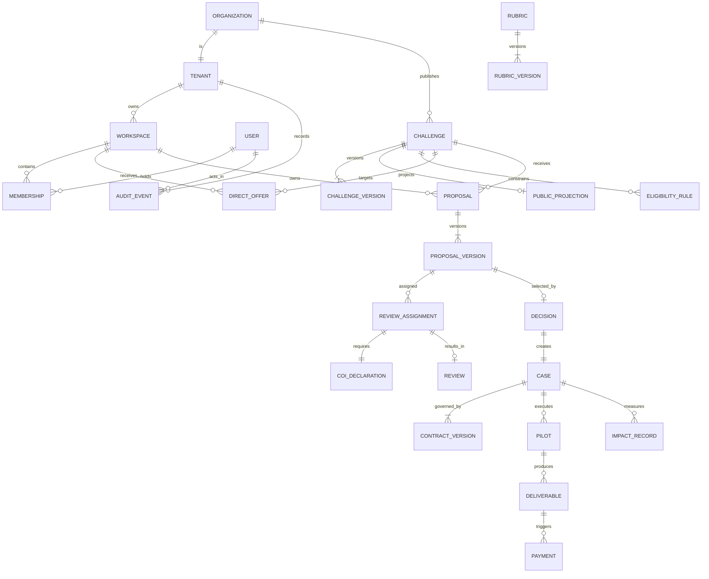

# Canonical Model — the single source of truth

This document is **law** for the whole blueprint. Every database column, API field, permission rule, event name, and UI label uses these names, states, and identities. It reconciles the three lifecycle vocabularies, three role models, and four solver-type enums found in source into one coherent model. Traceability to the current code is given so nothing is invented without evidence.

---

## 1. Glossary (canonical terms)

| Term                  | Definition                                                                                                                                                                | Retired synonyms found in code                                                     |
| --------------------- | ------------------------------------------------------------------------------------------------------------------------------------------------------------------------- | ---------------------------------------------------------------------------------- |
| **Tenant**            | Top-level isolation boundary. An **Organization** is a tenant; the platform operator is a tenant. Every protected row belongs to exactly one tenant.                      | — (not yet modeled server-side)                                                    |
| **Workspace**         | A working context a user acts _in_. Kinds: `org` (organization workspace), `individual` (personal solver space), `team` (shared solver space).                            | `SolverSpace`, `PersonalWorkspace`, `ActiveWorkspace` (`domain/solver.ts:1,12,68`) |
| **Membership**        | The link `(user → workspace)` carrying a role and state.                                                                                                                  | `TeamMembership` (`domain/solver.ts:56`)                                           |
| **Party**             | The kind of actor a subject is in a given interaction: Organization, Solver, Reviewer, Operations, Finance, Legal, Guest.                                                 | `InternalRole` (`domain/product.ts:1`), part of `Actor` (`state-machines.ts:12`)   |
| **Challenge**         | An organization's published (or in-flight) problem statement + terms.                                                                                                     | `ChallengeRecord` (`domain/challenge.ts:51`)                                       |
| **Case**              | The continuous record binding a challenge to its winning proposal, contract, pilot, deliverables, payments, feedback, and impact. The lifecycle's second half lives here. | `CaseRecord` (`domain/solver.ts:388`), `CaseState` (`domain/product.ts:15`)        |
| **Proposal**          | A solver/team submission to a challenge; owns immutable **Proposal Versions**.                                                                                            | `Proposal`, `ProposalVersion` (`domain/solver.ts:226,215`)                         |
| **Direct Offer**      | An organization's targeted invitation to a specific workspace to respond/propose.                                                                                         | `DirectOffer` (`domain/solver.ts:261`)                                             |
| **Review Assignment** | The record connecting a reviewer to a proposal version + rubric version + due date.                                                                                       | implied by `ReviewState` (`state-machines.ts:625`)                                 |
| **COI declaration**   | A reviewer's conflict-of-interest status for one assignment.                                                                                                              | `ReviewCoiState` (`lib/reviews/access.ts:1`)                                       |
| **Rubric**            | A versioned scoring template (criteria + weights).                                                                                                                        | (fixtures only)                                                                    |
| **Contract**          | Versioned legal agreement + IP schedule governing a case.                                                                                                                 | `SolverContract`, `ContractState` (`domain/solver.ts:360,368`)                     |
| **Pilot**             | The execution plan (milestones, tasks, KPIs, evidence) of a case.                                                                                                         | `PilotState` (`state-machines.ts:810`), `CaseRecord.pilot`                         |
| **Deliverable**       | A submitted work product under a pilot, with acceptance lifecycle.                                                                                                        | `PilotState` deliverable arm, `CaseRecord.deliverables`                            |
| **Payment**           | A money movement bound to a milestone, with financial-control lifecycle.                                                                                                  | `PaymentState` (`state-machines.ts:870`)                                           |
| **Impact record**     | Baseline/target/actual measurement + validation + scale/repeat/stop decision.                                                                                             | (fixtures + `impact` stage of `CaseState`)                                         |
| **Receipt**           | Durable proof of a completed sensitive mutation (id + audit event + timestamp).                                                                                           | `MutationReceipt` (`domain/solver.ts:497`)                                         |
| **Audit event**       | Append-only correlated record of a business mutation.                                                                                                                     | `SolverAuditEvent` (`domain/solver.ts:457`)                                        |
| **Idempotency key**   | Client-supplied token making a command safe to retry exactly once.                                                                                                        | `SolverState.idempotency` (`domain/solver.ts:494`)                                 |
| **Public projection** | The read-only, publishable subset of a private aggregate (e.g. published challenge card).                                                                                 | `lib/challenges/public-catalog.ts`                                                 |

## 2. Actors (parties) and jobs to be done

| Party                   | Primary job                                                                  | Non-negotiable trust requirement                                             |
| ----------------------- | ---------------------------------------------------------------------------- | ---------------------------------------------------------------------------- |
| **Guest**               | Discover credible challenges; understand the process                         | No confidential leakage; no misleading claims                                |
| **Organization member** | Create → approve → publish → evaluate → decide → contract → operate a case   | Tenant isolation, role permissions, versioned approvals, auditable decisions |
| **Individual solver**   | Find eligible opportunities; submit a defensible proposal                    | Identity, IP protection, private workspace, transparent status & payment     |
| **Team member**         | Collaborate under explicit roles; submit as a team                           | Ownership integrity, membership lifecycle, workspace-scoped records          |
| **Reviewer**            | Independently evaluate assigned proposals                                    | COI declared before protected content; rubric/version integrity              |
| **Operations**          | Run verification, publication quality, disputes, payment exceptions, support | Least privilege, reason codes, separation of duties, immutable audit         |
| **Finance approver**    | Approve and reconcile payments                                               | Effective contract + technical acceptance + separate financial approval      |
| **Legal approver**      | Approve contract/IP gates                                                    | Effective versions, jurisdiction, provider-backed signature                  |

## 3. Role model (D4) — three orthogonal namespaces

The flat `Actor` union in `state-machines.ts:12` is **retired** because it mixes party-type (`org`, `reviewer`, `ops`, `finance`, `legal`, `solver`) with team-role (`owner`, `admin`, `proposal-manager`, `contributor`, `viewer`). Canonical roles are namespaced and independent:

```
platform:*   ops · finance · legal · reviewer · admin           (operator tenant)
org:*        owner · member · approver_technical ·
             approver_legal · approver_finance · publisher       (organization tenant)
team:*       owner · admin · proposal-manager · contributor · viewer   (team workspace)
individual   (implicit sole role of a personal workspace)
```

- A subject may hold roles in several namespaces simultaneously (a person can be an org member _and_ a solver _and_ a reviewer). Active context is chosen via workspace switch (`ActiveWorkspace`), never inferred from a route prefix.
- `team:*` values are exactly today's `TeamRole` (`domain/solver.ts:19`) — the most mature part of the code and kept verbatim.
- `platform:*` and `org:*` are **new**: the code only has coarse `InternalRole = org|solver|reviewer|ops`. Operations sub-roles and org approver roles must be created to satisfy separation-of-duty in `publicationGates` and the payment machine.

**Mapping of the old `Actor` values → canonical:**

| Old `Actor`                                               | Canonical                                                                                                    |
| --------------------------------------------------------- | ------------------------------------------------------------------------------------------------------------ |
| `solver`                                                  | party=Solver, role=`individual` or `team:*`                                                                  |
| `owner`,`admin`,`proposal-manager`,`contributor`,`viewer` | `team:owner` … `team:viewer`                                                                                 |
| `team-manager`                                            | alias of `team:owner`/`team:admin` (submission-authorized) — **ambiguous in code**, resolve to explicit role |
| `org`                                                     | party=Organization, role in `org:*`                                                                          |
| `reviewer`                                                | party=Reviewer, role=`platform:reviewer`                                                                     |
| `ops`                                                     | `platform:ops`                                                                                               |
| `finance`                                                 | `platform:finance`                                                                                           |
| `legal`                                                   | `platform:legal`                                                                                             |

## 4. The one lifecycle (D1–D3)

There is **one** Challenge/Case lifecycle. Stages before `published` are **Challenge** stages (owned by the organization intake + approvals). Stages from `evaluating` onward are **Case** stages (the continuous record).

```
draft → triage → formulation → approvals → published → evaluating → decided
      → contracting → pilot → impact → closed
```

| Canonical stage | Meaning                                                     | Owner                        | Entry gate                                       |
| --------------- | ----------------------------------------------------------- | ---------------------------- | ------------------------------------------------ |
| `draft`         | Intake authoring in progress                                | org:member                   | —                                                |
| `triage`        | Screening the brief for fit/quality                         | org:member + platform:ops    | brief-valid                                      |
| `formulation`   | Sharpening problem, success criteria, scope                 | org:member                   | triage-passed                                    |
| `approvals`     | Independent technical/legal/finance + ops publication gates | org approvers + platform:ops | formulation-complete                             |
| `published`     | Live to eligible solvers; approved version locked           | org:publisher                | technical+legal+finance approved, quality passed |
| `evaluating`    | Submission window closed; proposals under review            | org:member                   | submission-window-closed                         |
| `decided`       | Reasoned selection / no-award recorded                      | org:member                   | reviews-complete, decision-rationale             |
| `contracting`   | Contract + IP negotiation → effective                       | org + legal                  | winner-selected                                  |
| `pilot`         | Execution: milestones, deliverables, acceptance             | org + team                   | contract-effective                               |
| `impact`        | Measured outcome vs baseline/target                         | org:member                   | deliverables-resolved                            |
| `closed`        | Reconciled, feedback collected, evidence sealed             | org:member                   | payments-reconciled                              |

### 4.1 Reconciliation of the three code vocabularies

| Canonical     | `ChallengeState` (`state-machines.ts:52`) | `CaseState` (`product.ts:15`) | `ChallengeStatus` (`challenge.ts:1`) — intake editor |
| ------------- | ----------------------------------------- | ----------------------------- | ---------------------------------------------------- |
| `draft`       | draft                                     | draft                         | `draft` / `ready` / `needs_changes`                  |
| `triage`      | triage                                    | triage                        | `under_review`                                       |
| `formulation` | _(absent — fold in)_                      | formulation                   | _(authoring)_                                        |
| `approvals`   | approvals                                 | quality-review                | _(authoring)_                                        |
| `published`   | published                                 | published                     | `published`                                          |
| `evaluating`  | evaluating                                | evaluation                    | —                                                    |
| `decided`     | decided                                   | _(absent — add)_              | —                                                    |
| `contracting` | contracting                               | contracting                   | —                                                    |
| `pilot`       | pilot                                     | pilot                         | —                                                    |
| `impact`      | _(absent — add)_                          | impact                        | —                                                    |
| `closed`      | closed                                    | closed                        | `closed`                                             |

**Resolution rules:**

- `ChallengeStatus.ready` and `.needs_changes` are **authoring sub-statuses of `draft`**, not lifecycle stages. `isDraftStatus()` (`challenge.ts:167`) already treats them as one group — keep that as the editor's local status; the server tracks the canonical stage.
- `product.ts` `quality-review` **folds into** `approvals` (it is the ops publication gate within approvals).
- `state-machines.ts` gains `formulation` and `impact`; `product.ts` gains `decided`.
- Retire the two competing `canTransition` functions (`state-machines.ts:37` generic, `product.ts:119` case-specific). Keep **one**: the generic table-driven `canTransition` over the reconciled challenge table. The `caseTransitions` adjacency map in `product.ts` is superseded.

### 4.2 Sub-entity state machines (kept from `state-machines.ts`, canonical)

These are well-designed and kept **verbatim** as the authoritative transition tables (each row already carries actor, preconditions, side effects, notification, audit code, retry policy):

| Machine                | States                                                                                                                                                                                                  | Source                                   |
| ---------------------- | ------------------------------------------------------------------------------------------------------------------------------------------------------------------------------------------------------- | ---------------------------------------- |
| **Proposal**           | draft, submitted, eligibility_review, eligible, ineligible, clarification_requested, clarification_submitted, reviewing, revision_requested, revision_draft, resubmitted, selected, rejected, withdrawn | `solver.ts:166`, `state-machines.ts:146` |
| **Direct Offer**       | received, viewed, response_draft, response_submitted, negotiating, selected, declined, expired, cancelled                                                                                               | `solver.ts:250`, `state-machines.ts:461` |
| **Team Invitation**    | sent, viewed, accepted, declined, expired, revoked                                                                                                                                                      | `solver.ts:79`, `state-machines.ts:324`  |
| **Membership Request** | requested, accepted, rejected, withdrawn, expired                                                                                                                                                       | `solver.ts:106`, `state-machines.ts:418` |
| **Membership**         | invited, requested, active, rejected, expired, suspended, removed                                                                                                                                       | `solver.ts:47`, `state-machines.ts:544`  |
| **Review**             | coi-gate, accepted, draft, submitted, locked, invalidated                                                                                                                                               | `state-machines.ts:625`                  |
| **Contract**           | draft, negotiation, approval, signature, effective, rejected, superseded                                                                                                                                | `solver.ts:360`, `state-machines.ts:685` |
| **Verification**       | not_started, draft, submitted, under_review, verified, needs_revision, rejected, expired                                                                                                                | `solver.ts:322`, `state-machines.ts:736` |
| **Pilot/Deliverable**  | planned, running, deliverable-submitted, accepted, revision, rejected                                                                                                                                   | `state-machines.ts:810`                  |
| **Payment**            | triggered, approval, processing, paid, reconciled, hold, failed, refunded                                                                                                                               | `state-machines.ts:870`                  |

> **D9 note:** `CaseRecord` (`solver.ts:388`) embeds _simplified_ payment (`triggered…failed`, missing `reconciled`/`refunded`) and deliverable (`draft/submitted/revision/accepted/rejected`) states. These are **UI projections**; the authoritative machines above govern server transitions. Align the projections or generate them from the canonical states.

### 4.3 Review + COI (D8)

Review has **two** dimensions that the code currently splits across `ReviewState` and a separate `localStorage` flag:

- **Assignment lifecycle** (`ReviewState`): `coi-gate → accepted → draft → submitted → locked → invalidated`.
- **COI declaration** (`coiStatus ∈ {pending, clear, conflict}`, from `lib/reviews/access.ts:1`): a first-class server record, one per assignment.

The `coi-gate → accepted` transition's precondition `coi-clear` = `coiStatus == 'clear'`. Protected materials are gated server-side (API, object store signed URLs, exports, and UI) on `coiStatus == 'clear'` **and** an active, non-invalidated assignment. `conflict` routes to operations escalation and never yields material access.

## 5. Applicant & team taxonomy (D6, D7)

**One `ApplicantType`** replaces the four divergent enums:

```
ApplicantType = individual | expert-team | company | lab | academic-group
```

| Old enum                                   | Value                                        | → Canonical                                             |
| ------------------------------------------ | -------------------------------------------- | ------------------------------------------------------- |
| `challenge.ts:44` `SolverType`             | individual                                   | individual                                              |
|                                            | team                                         | expert-team                                             |
|                                            | company                                      | company                                                 |
|                                            | university                                   | academic-group (or lab if research facility)            |
| `solver.ts:20` `TeamType` → **`TeamKind`** | expert-team / lab / academic-group / company | same (subset of `ApplicantType`, excludes `individual`) |
| `eligibility.ts:3` `ApplicantType`         | already canonical                            | canonical                                               |

**`TeamType` name collision resolved (D7):**

- The challenge-side `TeamType = person|team|both` is implemented as **`ApplicantScope`** in `domain/taxonomy.ts`, and `ChallengeRecord.applicantScope` answers "who may apply to this challenge". Demo-store v8 migrates the v7/v6 values one-to-one and rejects unknown legacy values to the empty authoring sentinel.
- The solver-side legacy `solver.ts:20` `TeamType` must be renamed **`TeamKind`** (answers "what kind of team is this"); it remains a separate migration because the solver store is independently versioned.

## 6. Core entity graph (canonical)



**Production-only entities** (absent in the prototype, required by the model): `TENANT`, `CHALLENGE_VERSION`, `PUBLIC_PROJECTION`, `RUBRIC` / `RUBRIC_VERSION`, `REVIEW_ASSIGNMENT` (as a real row), `COI_DECLARATION`, `DECISION` (as a real row), `IMPACT_RECORD`, plus cross-cutting `FILE_OBJECT`, `NOTIFICATION_DELIVERY`, `IDEMPOTENCY_KEY`, `OUTBOX_EVENT`, `DISPUTE`, `CONSENT`, `PRIVILEGED_ACCESS_GRANT`, `POLICY_VERSION`.

## 7. Entity identity rules

1. **Stable opaque IDs.** IDs are server-minted, globally unique, and carry **no** tenant secret or authorization meaning (do not authorize from an ID's shape). Prefixed for readability: `chl_`, `chv_` (challenge version), `prp_`, `prv_`, `rva_` (review assignment), `case_`, `ctr_`, `pay_`, etc.
2. **One owning tenant + one owning workspace** per protected row; every query is scoped by tenant/workspace _before_ record permissions.
3. **Human-facing tracking codes** (`trackingCode` in `solver.ts:236,289`, and fixture IDs like `CH-1405-021`) are display aliases, **not** primary keys.
4. **Versions are immutable.** `ProposalVersion.locked`, challenge published version, rubric version, contract version, and review submission are append-only; a change creates a new version with an explicit base and diff (`ProposalVersion.changedFields` is the existing pattern).
5. **Unknown IDs never fall back to a sample record** (already a tested invariant — keep it server-side as non-enumerating not-found).

## 8. Cross-cutting invariants (canonical, enforce server-side)

Drawn from executable rules already in the prototype — promoted from client hints to server law:

1. A challenge cannot jump `draft → published`; it must pass `triage → formulation → approvals`.
2. Publication requires **independent** technical + legal + finance approvals _and_ an ops quality gate, each attributed to a specific actor and challenge version (`publicationGates`, `challengeTransitions[approvals→published]`).
3. Proposal submission requires a valid form, an authorized sender, and accepted terms; it creates and **locks** a version and emits a receipt.
4. Submitted proposal versions and submitted reviews are **immutable**; revisions are new versions.
5. Reviewer access to protected content requires `coiStatus == clear` (D8).
6. Technical acceptance, finance approval, and effective contract are **three separate** payment gates (`paymentTransitions`); no payment processes without all three.
7. Team owner transfer/removal ≠ manager role change; the **last active manager** and the **owner** cannot be removed without transfer (`canRemoveMembership`, `membershipTransitions`).
8. Closing a case requires resolved deliverables and reconciled payments.
9. Every sensitive mutation is **idempotent** (dedupe on idempotency key) and emits a correlated **audit event** + **receipt**.
10. Sensitive actions may require **step-up** (2FA freshness) and a **structured reason** (`sensitiveActions` set in `product.ts:42`).

## 9. Standard result & error contract (from `solver.ts`, promoted to the API)

The solver repository already defines the exact shape the API should return. Canonicalize it:

```ts
type MutationReceipt = {
  ok: true;
  entityId;
  receiptId;
  auditEventId;
  timestamp;
  idempotent: boolean;
};
type MutationFailure = {
  ok: false;
  code: "NOT_FOUND" | "NO_ACCESS" | "INVALID_STATE" | "CONFLICT" | "VALIDATION" | "STORAGE";
  message;
};
```

These six codes map directly to HTTP status + error envelope in [60_API_CONTRACT](60_API_CONTRACT.md) §4. This is the model's biggest gift to the backend: a battle-tested command-result contract already exists.
