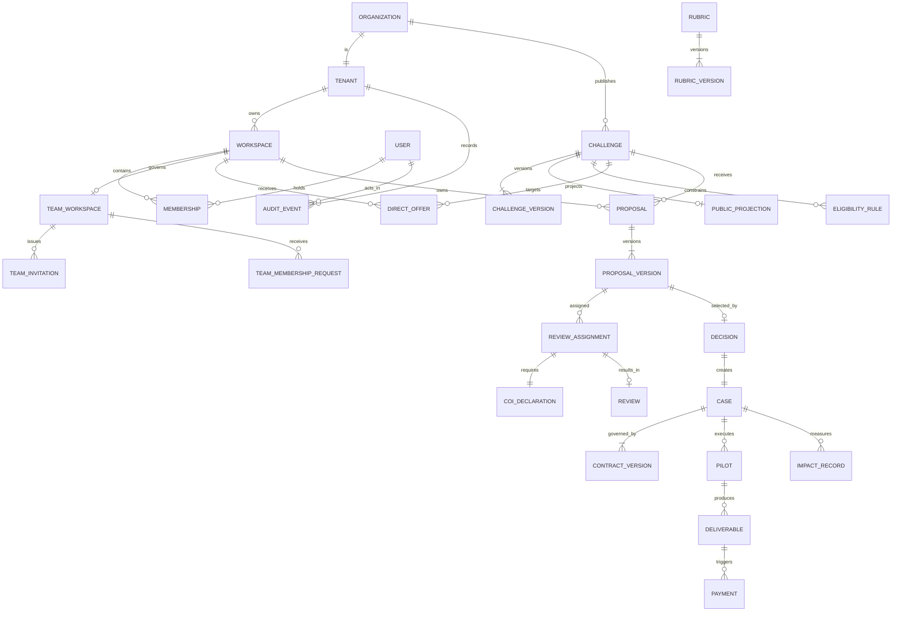

# Canonical Model — the single source of truth

This document is **law** for the whole blueprint. Every database column, API field, permission rule, event name, and UI label uses these names, states, and identities. It reconciles the three lifecycle vocabularies, three role models, and four solver-type enums found in source into one coherent model. Traceability to the current code is given so nothing is invented without evidence.

---

## 1. Glossary (canonical terms)

| Term                  | Definition                                                                                                                                                                | Retired synonyms found in code                                                     |
| --------------------- | ------------------------------------------------------------------------------------------------------------------------------------------------------------------------- | ---------------------------------------------------------------------------------- |
| **Tenant**            | Top-level isolation boundary. An **Organization** is a tenant; the platform operator is a tenant. Every protected row belongs to exactly one tenant.                      | Implicit organization/solver account boundaries                                    |
| **Workspace**         | A working context a user acts _in_. Kinds: `platform` (operator space), `org` (organization space), `individual` (personal solver space), `team` (shared solver space).   | `SolverSpace`, `PersonalWorkspace`, `ActiveWorkspace` (`domain/solver.ts:1,12,68`) |
| **Membership**        | The link `(user → workspace)` carrying a role and state.                                                                                                                  | `TeamMembership` (`domain/solver.ts:56`)                                           |
| **Party**             | The kind of participant a subject is in a given interaction: Organization, Solver, Reviewer, Operations, Finance, Legal, Guest.                                           | former flat `InternalRole` / `Actor`; `AppPersona` is presentation-only            |
| **Challenge**         | An organization's published (or in-flight) problem statement + terms.                                                                                                     | `ChallengeRecord` (`domain/challenge.ts:51`)                                       |
| **Case**              | The continuous record binding a challenge to its winning proposal, contract, pilot, deliverables, payments, feedback, and impact. The lifecycle's second half lives here. | `CaseRecord` (`domain/solver.ts`); former duplicate `CaseState` removed            |
| **Proposal**          | A solver/team submission to a challenge; owns immutable **Proposal Versions**.                                                                                            | `@rahhal/domain`; browser projection in `domain/solver.ts`                         |
| **Direct Offer**      | An organization's targeted invitation to a specific workspace to respond/propose.                                                                                         | `packages/domain/src/opportunity.ts`; migration `0018`                             |
| **Review Assignment** | The record connecting a reviewer to a proposal version + rubric version + due date.                                                                                       | `packages/domain/src/review.ts`; migrations `0022`-`0027`                          |
| **COI declaration**   | A reviewer's conflict-of-interest status for one assignment.                                                                                                              | `packages/domain/src/review.ts`; migration `0026`                                  |
| **Rubric**            | A versioned scoring template (criteria + weights).                                                                                                                        | `packages/domain/src/rubric.ts`; migration `0023`                                  |
| **Contract**          | Versioned legal agreement + IP schedule governing a case.                                                                                                                 | `SolverContract`, `ContractState` (`domain/solver.ts:360,368`)                     |
| **Pilot**             | The execution plan (milestones, tasks, KPIs, evidence) of a case.                                                                                                         | `PilotState` (`state-machines.ts:810`), `CaseRecord.pilot`                         |
| **Deliverable**       | A submitted work product under a pilot, with acceptance lifecycle.                                                                                                        | `PilotState` deliverable arm, `CaseRecord.deliverables`                            |
| **Payment**           | A money movement bound to a milestone, with financial-control lifecycle.                                                                                                  | `PaymentState` (`state-machines.ts:870`)                                           |
| **Impact record**     | Baseline/target/actual measurement + validation + scale/repeat/stop decision.                                                                                             | fixtures; canonical `impact` transition is executable in `@rahhal/domain`          |
| **Receipt**           | Durable proof of a completed sensitive mutation (id + audit event + timestamp).                                                                                           | `MutationReceipt` (`domain/solver.ts:497`)                                         |
| **Audit event**       | Append-only correlated record of a business mutation.                                                                                                                     | `SolverAuditEvent` (`domain/solver.ts:457`)                                        |
| **Idempotency key**   | Client-supplied token making a command safe to retry exactly once.                                                                                                        | `SolverState.idempotency` (`domain/solver.ts:494`)                                 |
| **Public projection** | The read-only, publishable subset of a private aggregate (e.g. published challenge card).                                                                                 | `lib/challenges/public-catalog.ts`                                                 |

Server-authoritative proposal vocabulary and content live in `packages/domain/src/proposal.ts`. C3 supplies explicit demo and PostgreSQL draft adapters; `domain/solver.ts` remains only the browser/demo projection until C9 connects the web runtime.

## 2. Actors (parties) and jobs to be done

| Party                   | Primary job                                                                  | Non-negotiable trust requirement                                             |
| ----------------------- | ---------------------------------------------------------------------------- | ---------------------------------------------------------------------------- |
| **Guest**               | Discover credible challenges; understand the process                         | No confidential leakage; no misleading claims                                |
| **Organization member** | Create → approve → publish → evaluate → decide → contract → operate a case   | Tenant isolation, role permissions, versioned approvals, auditable decisions |
| **Individual solver**   | Find eligible opportunities; submit a defensible proposal                    | Identity, IP protection, private workspace, transparent status & payment     |
| **Team member**         | Collaborate under explicit roles; submit as a team                           | Ownership integrity, membership lifecycle, workspace-scoped records          |
| **Reviewer**            | Independently evaluate assigned proposals                                    | COI declared before protected content; rubric/version integrity              |
| **Operations**          | Run verification, publication quality, disputes, payment exceptions, support | Least privilege, reason codes, separation of duties, immutable audit         |
| **Finance approver**    | Approve and reconcile payments                                               | Effective contract + technical acceptance + separate financial approval      |
| **Legal approver**      | Approve contract/IP gates                                                    | Effective versions, jurisdiction, provider-backed signature                  |

## 3. Role model (D4) — three orthogonal namespaces

The flat `Actor` union in `state-machines.ts:12` is **retired** because it mixes party-type (`org`, `reviewer`, `ops`, `finance`, `legal`, `solver`) with team-role (`owner`, `admin`, `proposal-manager`, `contributor`, `viewer`). Canonical roles are namespaced and independent:

```
platform:*   ops · finance · legal · reviewer · admin           (operator tenant)
org:*        owner · member · approver_technical ·
             approver_legal · approver_finance · publisher       (organization tenant)
team:*       owner · admin · proposal-manager · contributor · viewer   (team workspace)
individual   (implicit sole role of a personal workspace)
```

- A subject may hold roles in several namespaces simultaneously (a person can be an org member _and_ a solver _and_ a reviewer). Active context is chosen via workspace switch (`ActiveWorkspace`), never inferred from a route prefix.
- `team:*` values are exactly today's `TeamRole` (`domain/solver.ts:19`) — the most mature part of the code and kept verbatim.
- `platform:*`, `org:*`, and `team:*` have browser-free shared definitions in `packages/domain/src/workspace.ts`. The shared challenge lifecycle, root transition tables, initial API, organization permission oracle, and solver aggregate all consume those values.
- `AppPersona = org|solver|reviewer|ops` remains only a routing/demo-session presentation discriminator. It is deliberately not accepted by the authorization or transition contracts.
- Solver demo-store v5 migrates the former flat team-role values and writes a one-version v4 rollback mirror with the old values. Production commands and database fields must never persist the flat values.

**Mapping of the old `Actor` values → canonical:**

| Old `Actor`                                               | Canonical                                                                                                    |
| --------------------------------------------------------- | ------------------------------------------------------------------------------------------------------------ |
| `solver`                                                  | party=Solver, role=`individual` or `team:*`                                                                  |
| `owner`,`admin`,`proposal-manager`,`contributor`,`viewer` | `team:owner` … `team:viewer`                                                                                 |
| `team-manager`                                            | alias of `team:owner`/`team:admin` (submission-authorized) — **ambiguous in code**, resolve to explicit role |
| `org`                                                     | party=Organization, role in `org:*`                                                                          |
| `reviewer`                                                | party=Reviewer, role=`platform:reviewer`                                                                     |
| `ops`                                                     | `platform:ops`                                                                                               |
| `finance`                                                 | `platform:finance`                                                                                           |
| `legal`                                                   | `platform:legal`                                                                                             |

## 4. The one lifecycle (D1–D3)

There is **one** Challenge/Case lifecycle. Stages before `published` are **Challenge** stages (owned by the organization intake + approvals). Stages from `evaluating` onward are **Case** stages (the continuous record).

```
draft → triage → formulation → approvals → published → evaluating → decided
      → contracting → pilot → impact → closed
```

| Canonical stage | Meaning                                                     | Owner                        | Entry gate                                       |
| --------------- | ----------------------------------------------------------- | ---------------------------- | ------------------------------------------------ |
| `draft`         | Intake authoring in progress                                | org:member                   | —                                                |
| `triage`        | Screening the rough brief for fit/quality                   | org:member + platform:ops    | rough-brief-valid                                |
| `formulation`   | Sharpening problem, success criteria, scope                 | org:member                   | triage-passed                                    |
| `approvals`     | Independent technical/legal/finance + ops publication gates | org approvers + platform:ops | formulation-complete                             |
| `published`     | Live to eligible solvers; approved version locked           | org:publisher                | technical+legal+finance approved, quality passed |
| `evaluating`    | Submission window closed; proposals under review            | org:member                   | submission-window-closed                         |
| `decided`       | Reasoned selection / no-award recorded                      | org:member                   | reviews-complete, decision-rationale             |
| `contracting`   | Contract + IP negotiation → effective                       | org + legal                  | winner-selected                                  |
| `pilot`         | Execution: milestones, deliverables, acceptance             | org + team                   | contract-effective                               |
| `impact`        | Measured outcome vs baseline/target                         | org:member                   | deliverables-resolved                            |
| `closed`        | Reconciled, feedback collected, evidence sealed             | org:member                   | payments-reconciled                              |

### 4.1 Reconciliation of the three code vocabularies

| Canonical     | `ChallengeState` (`state-machines.ts`) | Former `CaseState` mapping (removed) | `ChallengeStatus` (`challenge.ts`) — intake editor |
| ------------- | -------------------------------------- | ------------------------------------ | -------------------------------------------------- |
| `draft`       | draft                                  | draft                                | `draft` / `ready` / `needs_changes`                |
| `triage`      | triage                                 | triage                               | `under_review`                                     |
| `formulation` | formulation                            | formulation                          | _(authoring)_                                      |
| `approvals`   | approvals                              | quality-review                       | _(authoring)_                                      |
| `published`   | published                              | published                            | `published`                                        |
| `evaluating`  | evaluating                             | evaluation                           | —                                                  |
| `decided`     | decided                                | _(absent)_                           | —                                                  |
| `contracting` | contracting                            | contracting                          | —                                                  |
| `pilot`       | pilot                                  | pilot                                | —                                                  |
| `impact`      | impact                                 | impact                               | —                                                  |
| `closed`      | closed                                 | closed                               | `closed`                                           |

**Resolution rules:**

- `ChallengeStatus.ready` and `.needs_changes` are **authoring sub-statuses of `draft`**, not lifecycle stages. `isDraftStatus()` (`challenge.ts:167`) already treats them as one group — keep that as the editor's local status; the server tracks the canonical stage.
- The former `product.ts` `quality-review` value folds into `approvals`; its entire duplicate `CaseState`/adjacency model is now removed.
- X-01 is resolved: `packages/domain/src/challenge.ts` owns the exact 11-stage vocabulary and the ten guarded edges; root `state-machines.ts` re-exports that shared server-safe definition.
- X-02 is resolved: only the generic table-driven `state-machines.ts` `canTransition` remains; the two-argument adjacency helper and `caseTransitions` are removed.
- `triage_readiness` is deliberately narrower than full formulation readiness: it proves the five rough-brief fields needed for screening, while `readiness` must pass before `formulation → approvals`. The organization submits the rough brief; `platform:ops` may accept the purpose-scoped triage item and return it to the organization for formulation.
- A rejected publication gate is final evidence for that exact challenge version. The canonical graph does not gain a backwards edge: an authorized edit of the rejected aggregate creates a new immutable version in `formulation`, and the new version starts with no approval rows.

### 4.2 Sub-entity state machines (canonical)

Each row carries canonical roles, preconditions, side effects, notification, audit code, and retry policy. The proposal table now lives in `packages/domain/src/proposal.ts`, and root `state-machines.ts` re-exports it so the browser oracle and server cannot diverge. A listed team role is only a candidate actor: `sender-authorized`/`editor-authorized` still applies the complete team policy, active membership, and assignment context.

| Machine                | States                                                                                                                                                                                                  | Source                                                                   |
| ---------------------- | ------------------------------------------------------------------------------------------------------------------------------------------------------------------------------------------------------- | ------------------------------------------------------------------------ |
| **Proposal**           | draft, submitted, eligibility_review, eligible, ineligible, clarification_requested, clarification_submitted, reviewing, revision_requested, revision_draft, resubmitted, selected, rejected, withdrawn | `packages/domain/src/proposal.ts`; re-exported by `state-machines.ts`    |
| **Direct Offer**       | received, viewed, response_draft, response_submitted, negotiating, selected, declined, expired, cancelled                                                                                               | `packages/domain/src/opportunity.ts`; re-exported by `state-machines.ts` |
| **Team Invitation**    | sent, viewed, accepted, declined, expired, revoked                                                                                                                                                      | `packages/domain/src/team.ts`; migration `0015`                          |
| **Membership Request** | requested, accepted, rejected, withdrawn, expired                                                                                                                                                       | `packages/domain/src/team.ts`; migration `0015`                          |
| **Membership**         | invited, requested, active, rejected, expired, suspended, removed                                                                                                                                       | `packages/domain/src/workspace.ts`, `packages/domain/src/team.ts`        |
| **Review**             | coi-gate, accepted, draft, submitted, locked, invalidated, cancelled                                                                                                                                    | `packages/domain/src/review.ts`                                          |
| **Contract**           | draft, negotiation, approval, signature, effective, rejected, superseded                                                                                                                                | `solver.ts:360`, `state-machines.ts:685`                                 |
| **Verification**       | not_started, draft, submitted, under_review, verified, needs_revision, rejected, expired                                                                                                                | `solver.ts:322`, `state-machines.ts:736`                                 |
| **Pilot/Deliverable**  | planned, running, deliverable-submitted, accepted, revision, rejected                                                                                                                                   | `state-machines.ts:810`                                                  |
| **Payment**            | triggered, approval, processing, paid, reconciled, hold, failed, refunded                                                                                                                               | `state-machines.ts:870`                                                  |

> **D9 note:** `CaseRecord` (`solver.ts:388`) embeds _simplified_ payment (`triggered…failed`, missing `reconciled`/`refunded`) and deliverable (`draft/submitted/revision/accepted/rejected`) states. These are **UI projections**; the authoritative machines above govern server transitions. Align the projections or generate them from the canonical states.

### 4.3 Review + COI (D1-D7)

Review has **two** canonical dimensions, owned by `packages/domain/src/review.ts`. The root state-machine module and demo COI adapter re-export these types; browser storage remains demo-only:

- **Assignment lifecycle** (`ReviewState`): `coi-gate → accepted → draft → submitted → locked → invalidated`; Operations may move an unfinished `coi-gate`, `accepted`, or `draft` assignment to terminal `cancelled` with a reason. Cancellation or invalidation may append a distinct replacement against the same frozen evidence.
- **COI declaration** (`coiStatus ∈ {pending, clear, conflict}`): a first-class server record, one per assignment.

The `coi-gate → accepted` transition's precondition `coi-clear` = `coiStatus == 'clear'`. Protected materials are gated server-side (API, object store signed URLs, exports, and UI) on `coiStatus == 'clear'` **and** an active, non-invalidated assignment. `conflict` routes to operations escalation and never yields material access.

**D1 delivered boundary:** migration `0022` binds an assignment to an immutable locked proposal version, an exact challenge-version rubric, and a specific active reviewer membership/user. A pending COI record is created atomically. The read API returns assignment bookkeeping only; no materials, COI declarations, scoring or lifecycle mutations are exposed yet. DEC-2026-018 requires two independent reviewers per eligible proposal, Operations assignment authority, and organization-owner/member decision authority for the later evaluation commands.

**Rubric scoring (DEC-2026-019):** `packages/domain/src/rubric.ts` validates unique stable criterion IDs, labels, integer percentage weights totaling 100, and a fixed 0–5 integer score range. Every submitted criterion needs a rationale; an incomplete draft may omit criteria or temporarily hold an empty rationale. The calculation sums `weight × score` and divides by five for a result out of 100; its internal result uses integer tenths to avoid rounding a comparison. Invalid or incomplete inputs never produce a submitted result. D2 supplies authoritative rubric versions and D6 supplies the score draft/submission commands.

**D3 delivered boundary:** evaluation opening snapshots the current locked proposal version for every proposal in `eligible`, `reviewing`, or `resubmitted` and binds the latest exact-version rubric. Any proposal still in a submitted eligibility, clarification, or revision workflow blocks the transition. Draft, ineligible, and withdrawn work is excluded; an empty roster is valid and leads to the reasoned no-award path. The organization owner/member command moves the challenge from `published` to `evaluating`, closes intake, and freezes proposal/rubric version growth in one transaction. Later grant expiry does not rewrite the immutable roster.

**D4 delivered boundary (DEC-2026-020):** Operations assigns any active `platform:reviewer` in its active platform workspace to one frozen evaluation proposal/rubric pair. Two active assignments per eligible proposal are allowed and distinct reviewer users are required; assignment history prevents reusing the same human through another membership. There is no MVP workload cap. Operations chooses any future due date; overdue is a server-derived operational signal and does not revoke access. Reasoned cancellation revokes active assignment status immediately and preserves the row; replacement atomically cancels the old row and appends a new assignment for a different reviewer.

**D5 delivered boundary:** each assignment snapshots a pre-COI packet containing only organization name and challenge title. The assigned active reviewer makes one immutable, explicitly attested `clear` or categorized/reasoned `conflict` declaration. Clear atomically advances `coi-gate` version 1 to `accepted` version 2; conflict remains at the gate with version 2 and has no override into material access. Operations may still cancel or replace either pre-scoring state while preserving the packet/declaration evidence. Reviewer materials require that same active membership/user, `accepted` plus `clear`, and return the exact frozen proposal/rubric version IDs with a server-side technical/delivery projection. Solver identity, team history, commercial terms, declarations and attachment identifiers remain absent pending later visibility/file policy.

**D6 delivered boundary (DEC-2026-021):** the exact assigned reviewer may create and revise an incomplete score draft only while the assignment remains active, the membership remains active, and COI is clear. Submission requires every criterion exactly once, a whole 0–5 score and nonblank rationale, freezes the score array, and stores the server-calculated integer-tenths result. Operations explicitly locks a submitted review with a reason; only locked, non-invalidated evidence can later count toward DEC-2026-018 completeness. A distinct Operations actor may invalidate with a reason only when they are neither the reviewer nor a current owner/member of the deciding organization. Cancelled drafts and invalidated locked reviews remain immutable evidence; replacement appends a new assignment for a reviewer absent from that proposal's history. Reviewer material and own-score access end immediately on cancellation/invalidation. Operations sees status, timestamps, reasons and the weighted total needed to administer the queue, never criterion scores or rationales. D8 must recheck the two-review set under a challenge lock and refuse invalidation once immutable decision evidence exists.

**D7 delivered boundary (DEC-2026-022):** only an active owner/member in the challenge-owning workspace can read the frozen review comparison. The projection always exposes tracking/version references, per-proposal active/locked/cancelled/invalidated counts and the full-roster completion count. It exposes no reviewer, solver or workspace identity, individual review, rationale, lock/invalidation reason, or proposal content. Aggregate weighted and per-criterion means remain `null` for every proposal until every frozen proposal has exactly two distinct locked, non-invalidated reviews. At that single release point, the server revalidates each persisted score against the exact rubric and returns integer-tenths means; the browser does not decide release. An empty frozen roster is complete and remains eligible only for the D8 reasoned no-award path.

## 5. Applicant & team taxonomy (D6, D7)

**One `ApplicantType`** replaces the four divergent enums:

```
ApplicantType = individual | expert-team | company | lab | academic-group
```

| Source                                  | Value                                        | → Canonical                                            |
| --------------------------------------- | -------------------------------------------- | ------------------------------------------------------ |
| Former challenge-store v8 `solverTypes` | individual                                   | individual                                             |
|                                         | team                                         | expert-team                                            |
|                                         | company                                      | company                                                |
|                                         | university                                   | academic-group (never infer `lab`)                     |
| Former `solver.ts` `TeamType`           | expert-team / lab / academic-group / company | implemented as `TeamKind`, a subset of `ApplicantType` |
| `ChallengeRecord.allowedApplicantTypes` | canonical five-value set                     | typed directly with shared `ApplicantType`             |
| `eligibility.ts.allowedApplicantTypes`  | canonical five-value set                     | typed directly with shared `ApplicantType`             |

**`TeamType` name collision resolved (D7):**

- The challenge-side `TeamType = person|team|both` is implemented as **`ApplicantScope`** in `packages/domain/src/taxonomy.ts`; root `domain/taxonomy.ts` is a transitional web re-export. `allowedApplicantTypes` is authoritative and `ApplicantScope` is its derived coarse projection: empty set → `null`/empty authoring sentinel, individual only → `person`, team kinds only → `team`, and individual plus any team kind → `both`. The editor does not author it independently; API input that supplies a contradictory value receives `VALIDATION/derived_value`.
- X-04 is resolved in the challenge frontend: `SolverType`/`solverTypes` are removed in favor of shared `ApplicantType` and `ChallengeRecord.allowedApplicantTypes`. The v9 reader maps v8/v7/v6 deterministically (`individual → individual`, `team → expert-team`, `company → company`, `university → academic-group`), lets a present canonical field win in mixed records, and drops unknown string values without widening eligibility. After migration it validates every required aggregate field, enum, timestamp, boolean, and nested array; malformed records are rejected instead of cast. A one-version v8 rollback mirror is marked fresh only when every value is representable (`expert-team → team`, `academic-group → university`); if any record includes `lab`, the entire mirror and freshness marker are removed rather than publishing a semantically truncated snapshot. A durable v9-seen marker and legacy-source cleanup prevent v7/v6 from becoming fresh migration sources after v9 has committed.
- The solver-side collision is implemented as **`TeamKind`** in `packages/domain/src/taxonomy.ts`, and `SolverTeam.teamKind` answers "what kind of team is this". Solver demo-store v5 migrates valid v4 flat team roles to canonical `team:*` values; direct v3 upgrade also maps `teamType` to `teamKind`. An authoritative v5 persist makes a best-effort v4 rollback mirror with canonical `teamKind` and down-mapped flat roles. Invalid/missing kinds or roles reject the snapshot instead of widening access, corrupt-current recovery requires a fresh v4 mirror, and the v5-seen guard prevents stale v3 resurrection.
- `SolverTeamType` in `components/portal/registration-experiences.tsx` is deliberately **not** `TeamKind`: its `formal-company` / `independent` / university-supervision values are an ephemeral onboarding UI draft, are not persisted into `SolverState`, and remain deferred until team onboarding has a canonical affiliation/verification contract. These presentation variants must not extend `TeamKind` or enter an API/database schema.

**Solver onboarding and verification boundary (DEC-2026-016):**

- A signup selection describes onboarding intent, never a second identity or credential namespace. A provider-verified human receives exactly one permanent individual solver workspace and may own or join additional team workspaces through memberships.
- Verified contact, profile readiness, and workspace verification are distinct facts. A newly activated individual or team workspace may have verification state `not_started`; no UI may infer `verified` from signup completion, team creation, affiliation, or an authenticated session.
- An unverified workspace may maintain its profile, collaborate, discover/save opportunities, and draft. Verification gates submission only when the exact governed challenge version has `verification_required=true`; the submission transaction re-evaluates that fact against server-owned state.
- Team onboarding persists only canonical `TeamKind`: `formal-company → company`, `independent → expert-team`, and university variants → `academic-group`. Supervisor, institution, employer, and legal-affiliation details are separate profile or verification facts. `lab` remains an explicit canonical kind and is never inferred from “university”.

**Decision status:** the derived applicant-scope rule is accepted and implemented (DEC-2026-010); the onboarding/verification boundary is accepted for Phase 3 (DEC-2026-016). Existing v9 records are normalized and rewritten on read; the detailed allow-set is never inferred from a coarse legacy scope, so migration cannot broaden eligibility.

C1 implements this boundary server-side: each individual/team workspace has its own derived `ApplicantType`, profile/readiness facts and `verification_record`. A verified human contact is an identity fact only and never advances workspace verification. NDA and `document_acknowledgement` facts cite the exact published challenge version; the latter is a synthetic acknowledgement and must not be described as uploaded or reviewed evidence. Eligibility uses only the exact versioned rule plus the aggregate's live state/deadline and server time; unversioned profile readiness/expertise/geography remain descriptive facts, not hidden eligibility policy.

C2 makes team collaboration authoritative without creating a team credential. Creating a team creates a separate solver-owned `team` workspace, its canonical `TeamKind` profile, one active `team:owner` membership, and `not_started` verification. `packages/domain/src/team.ts` is the shared server decision matrix for owner/admin/proposal-manager/contributor/viewer actions and the eight durable policy switches. Invitations bind acceptance to the authenticated recipient identity; membership requests bind decisions to the exact requester; suspension, removal, leave, transfer, and archive preserve their evidence while immediately changing authority. Proposal managers may edit team profile facts only when `proposalManagersCanEditProfile` is enabled; verification and eligibility-gate authority remain limited to the individual, team owner, or team admin.

C3 makes private proposal authoring authoritative. Draft creation starts only from a registered-reachable, published, open, unexpired public challenge, but deliberately does not enforce C1 verification or final eligibility before C4 submission. Every draft belongs to the active solver `(tenant, workspace)`; individual assignment lists stay empty, while a team creator's active membership is assigned automatically. Team create/edit checks reuse `decideTeamPermission`; contributors can read/save only when assigned. Each save appends an unlocked, exact-base `proposal_version`, computes its changed-field set and content hash, and atomically advances the aggregate pointer/version with receipt, audit, outbox, and idempotency evidence. Attachment IDs remain opaque metadata references rather than file authority.

C4 makes submission and the first organization-side proposal read authoritative. Submission row-locks the solver-owned aggregate, rechecks current `submit-proposal` team authority/assignment, and evaluates the exact current published challenge rule plus C1 profile, verification, gate facts, and live call state/deadline under one server timestamp. IP, conflict, and accuracy declarations are unconditional form requirements; NDA acceptance is additionally required only when the exact rule selects it. Success appends a new exact-base locked version citing that challenge version, advances the aggregate to `submitted`, assigns durable tracking/time evidence, and creates one version-bound, `read`-only, time-bounded `access_grant` to the challenge-owning organization in the same receipt/audit/outbox/idempotency transaction. Organization inbox/detail reads begin from that active grant and expose only its exact locked version; revoked, expired, foreign, and unknown records are indistinguishable `NOT_FOUND`.

## 6. Core entity graph (canonical)



**Required as durable production entities:** `TENANT`, `CHALLENGE_VERSION`, `PUBLIC_PROJECTION`, `RUBRIC` / `RUBRIC_VERSION`, `REVIEW_ASSIGNMENT` (as a real row), `COI_DECLARATION`, `DECISION` (as a real row), `IMPACT_RECORD`, plus cross-cutting `FILE_OBJECT`, `NOTIFICATION_DELIVERY`, `IDEMPOTENCY_KEY`, `OUTBOX_EVENT`, `DISPUTE`, `CONSENT`, `PRIVILEGED_ACCESS_GRANT`, `POLICY_VERSION`. Phase 1 lands tenant/session/workspace, challenge/version, idempotency, outbox, audit, and mutation-receipt authority; Phase 2 completes the publication slice; C1 adds solver facts and exact-version gate acknowledgements; C2 adds team policy, invitation, request, membership, transfer, and archive authority; C3 activates proposal draft/version persistence without file storage. The remaining entities and broader production controls have not landed.

## 7. Entity identity rules

1. **Stable opaque IDs.** IDs are server-minted, globally unique, and carry **no** tenant secret or authorization meaning (do not authorize from an ID's shape). Prefixed for readability: `chl_`, `chv_` (challenge version), `tiv_` (team invitation), `tmr_` (team membership request), `prp_`, `prv_`, `rva_` (review assignment), `case_`, `ctr_`, `pay_`, etc.
2. **One owning tenant + one owning workspace** per protected row; every query is scoped by tenant/workspace _before_ record permissions.
3. **Human-facing tracking codes** (`trackingCode` in `solver.ts:236,289`, and fixture IDs like `CH-1405-021`) are display aliases, **not** primary keys.
4. **Versions are immutable.** Locked proposal versions, challenge published versions, rubric versions, contract versions, and review submissions are append-only; a change creates a new version with an explicit base and diff. Authoritative proposal content retains the browser form's fields while normalizing money to integer minor units and file references to opaque IDs; the C3 adapters perform that explicit conversion instead of persisting display-formatted values.
5. **Unknown IDs never fall back to a sample record** (already a tested invariant — keep it server-side as non-enumerating not-found).

## 8. Cross-cutting invariants (canonical, enforce server-side)

Drawn from executable rules already in the prototype — promoted from client hints to server law:

1. A challenge cannot jump `draft → published`; it must pass `triage → formulation → approvals`.
2. Publication requires **independent** technical + legal + finance approvals _and_ an ops quality gate, each attributed to a specific actor and challenge version (`publicationGates`, `challengeTransitions[approvals→published]`).
3. Proposal submission requires a valid form, an authorized sender, and accepted terms; it creates and **locks** a version and emits a receipt.
4. Submitted proposal versions and submitted reviews are **immutable**; revisions are new versions.
5. Reviewer access to protected content requires `coiStatus == clear` (D8).
6. Technical acceptance, finance approval, and effective contract are **three separate** payment gates (`paymentTransitions`); no payment processes without all three.
7. Team owner transfer/removal ≠ manager role change; the **last active manager** and the **owner** cannot be removed without transfer (`canRemoveTeamMembership`). C2 serializes manager-count changes on the team row and a deferred database constraint requires `workspace.owner_user_id` to equal exactly one active `team:owner` membership at commit.
8. Closing a case requires resolved deliverables and reconciled payments.
9. Every sensitive mutation is **idempotent** (dedupe on idempotency key) and emits a correlated **audit event** + **receipt**.
10. Sensitive actions may require **step-up** (2FA freshness) and a **structured reason** (`sensitiveActions` set in `product.ts:42`).
11. Eligibility conditions are snapshotted against the exact version entering approvals. After publication, mutable call state and deadline live on the challenge aggregate; an eligibility or submission decision must require both the published rule snapshot and the aggregate's current open/unexpired state.

## 9. Standard result & error contract

The browser solver receipt was the prototype input; the versioned contract in `packages/contracts` and [60_API_CONTRACT](60_API_CONTRACT.md) is now the exact API shape:

```ts
type MutationReceipt = {
  entity_id;
  receipt_id;
  audit_event_id;
  timestamp;
  idempotent: boolean;
  next_actions: string[];
};
type ApiFailure = {
  ok: false;
  error: {
    code:
      | "NOT_FOUND"
      | "NO_ACCESS"
      | "INVALID_STATE"
      | "CONFLICT"
      | "VALIDATION"
      | "STORAGE"
      | "STEP_UP_REQUIRED";
    message;
  };
  meta: {
    server_time;
    correlation_id;
    entity_version?;
  };
};
```

Success envelopes carry `server_time`, `correlation_id`, and the returned `entity_version`. These seven codes map directly to HTTP status and recovery metadata in [60_API_CONTRACT](60_API_CONTRACT.md) §4; `STEP_UP_REQUIRED` remains distinct from ordinary authorization denial so a client can start the approved step-up flow.
