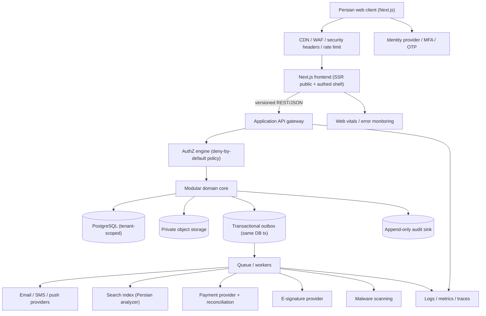

# Backend Architecture — production target

**Design stance:** the workflows are transaction-heavy, governance-critical, and small-team-operated. Start with a **modular monolith + asynchronous workers**, not microservices. Split a module into its own service only when scaling, security isolation, or team ownership gives evidence to. Uses canonical terms from [20_CANONICAL_MODEL](20_CANONICAL_MODEL.md).

---

## 1. System context



**Golden rule:** the browser is _never_ the authority. Every mutation is a server command that is authorized, validated, idempotent, transactional, and audited.

> **Foundation robustness:** [42_FOUNDATION_HARDENING](42_FOUNDATION_HARDENING.md) is the review that stress-tests this design for _this_ use case — the cross-tenant collaboration access model, explicit consistency/concurrency/resilience contracts, the evidence-gated scaling path, and the CI fitness functions that keep it solid. Read it alongside this document.

## 2. Module boundaries (the modular monolith)

One deployable API process; internally, strict module boundaries with dependency direction enforced by tests (the codebase already has zero import cycles — preserve that discipline).

| Module                     | Owns (aggregates)                                                                         | Key invariants                                                 |
| -------------------------- | ----------------------------------------------------------------------------------------- | -------------------------------------------------------------- |
| **Identity**               | user↔IdP link, verified contacts, session claims, MFA/step-up status                     | no password/secret storage in app; step-up freshness           |
| **Tenancy & Access**       | tenant, organization, workspace, membership, role, invitation, **authz policy**           | deny-by-default; scope-before-permission                       |
| **Challenge**              | challenge, challenge_version, eligibility_rule, approval, **public_projection**, deadline | no draft→published; publication is atomic + versioned          |
| **Solver & Team**          | personal/team profile, team, membership lifecycle, verification, NDA acceptance           | last-manager/owner protection; workspace isolation             |
| **Opportunity & Matching** | saved opportunity, eligibility evaluation, match evidence, direct_offer                   | eligibility explains itself; offer is a two-party aggregate    |
| **Proposal**               | proposal, proposal_version, clarification, revision                                       | submitted version immutable; one receipt per submit            |
| **Review**                 | rubric/rubric_version, review_assignment, **coi_declaration**, review                     | COI clear before protected content; submitted review immutable |
| **Decision & Case**        | decision, case                                                                            | decision cites exact versions; creates case atomically         |
| **Contract & IP**          | contract_version, IP schedule, signature                                                  | effective only from approved current version                   |
| **Pilot & Deliverable**    | pilot, milestone, task, deliverable, evidence                                             | acceptance protocol; change control                            |
| **Finance & Payment**      | payment, finance approval, ledger entry, reconciliation, refund                           | three gates; idempotent provider callbacks                     |
| **Operations & Dispute**   | work queue, verification review, publication gate, dispute, violation, support consent    | separation of duties; privileged access is time-bound          |
| **Notification**           | preference, template_version, delivery, retry/dead-letter                                 | delivery failure never changes business state                  |
| **Audit & Compliance**     | audit_event, correlation, export, retention, privileged_access_grant                      | append-only; independent of app admins                         |

Cross-cutting platform services (not domain modules): **Idempotency**, **Outbox/Eventing**, **File**, **Search**, **AuthZ**, and **Observability**. AI/inference remains a deferred RFC and is not part of the foundation runtime (ADR-0012).

## 3. Runtime & deployment model (D10)

- **Hybrid Next.js.** Public content (landing, challenge catalog, policy pages) keeps static/SSR generation for resilience and SEO. Authenticated workspaces are a client shell that calls the versioned API. Full static export is retained only as a demo/read-only artifact (never authoritative).
- **Repository shape** (introduce boundaries only as slices need them; do not move files to match a diagram). The current workspace layout is exact below; the existing Next.js web stays at the repository root during the Phase-1 transition:
  ```
  app/, components/    Root Next.js web + static/offline demo
  apps/api             Fastify transport + injected application ports
  apps/worker          Validated outbox-consumer boundary
  packages/contracts   Typed envelopes, JSON schemas, OpenAPI, event envelope
  packages/domain      Browser-free IDs, taxonomy, workspace, challenge primitives
  packages/testkit     Deterministic cross-workspace builders
  ```
- A later behavior-neutral target move may create `apps/web`; it is not a prerequisite for the API boundary. Generated web clients and `infra/` deployment definitions are also future additions. The root `domain/state-machines.ts` remains the current transition oracle and has not been moved into `packages/domain`.
- **Environments:** isolated dev / test / preview / staging / production with separate data, credentials, domains, provider accounts, and audit retention. Never clone production identity documents or confidential files into preview.

### Technology recommendation (ADR-0013/0014)

| Concern        | Recommendation                                                                               | Rationale                                                                                                                                |
| -------------- | -------------------------------------------------------------------------------------------- | ---------------------------------------------------------------------------------------------------------------------------------------- |
| API language   | **TypeScript/Node + Fastify 5** (ADR-0014)                                                   | Thin validated transport over injected application ports; one language across web/api/worker.                                            |
| DB             | **PostgreSQL**                                                                               | Transactions, constraints, RLS option, JSONB for versioned content, `tsvector` + Persian normalization for search.                       |
| Queue          | **Postgres-backed (pgmq/SKIP LOCKED)** at pilot scale → **Redis/SQS** if throughput demands  | Fewer moving parts; the outbox lives in the same DB tx.                                                                                  |
| Object storage | **S3-compatible in-region**, private buckets, pre-signed uploads                             | Residency (D-07); signed reads; scanning pipeline.                                                                                       |
| Search         | **Postgres FTS** first; **OpenSearch** if ranking/faceting outgrows it                       | Persian analyzer + permission filtering.                                                                                                 |
| Identity       | **Managed OIDC IdP** in the owner-approved pilot region + separate KYB/verification workflow | Don't build auth; do own verification. Concrete provider/issuer is blocked on the approval packet in [27](27_PHASE1_OWNER_APPROVALS.md). |
| Audit sink     | Append-only Postgres table with periodic export to WORM storage                              | Independence from app admins (40 §5).                                                                                                    |
| Vector / AI    | **Deferred; no foundation datastore, model adapter, or provider egress** (ADR-0012)          | A later approved RFC may add schema and infrastructure after classification/residency review; see [45](45_AI_AND_MATCHING.md).           |

## 4. Identity, session & tenancy

- **Authentication** delegated to an OIDC IdP. The app stores only a `user↔subject` link, verified contacts, and MFA status. OTP/password/recovery are the IdP's job (retires the browser session in `lib/auth/session.ts`).
- **Session** = short-lived access token + rotating refresh; server-side revocation list; membership changes and session revocation **immediately** deny protected operations (a Phase-1 exit gate).
- **Safe return-to**: keep `lib/auth/return-to.ts`'s allowlisting, but validate server-side against authorized role context (FR-IAM-006).
- **Tenancy**: every protected row carries `tenant_id` + `workspace_id`. Active context is explicit (`ActiveWorkspace`), switched deliberately, never inferred from URL. A user may hold memberships in multiple workspaces/tenants. DEC-2026-011 proposes explicit `organization`/`solver`/`platform` tenant kinds and remains owner-gated in [27](27_PHASE1_OWNER_APPROVALS.md).

## 5. Audit & correlation (ADR-008)

- Every business mutation writes an **audit_event** in the _same transaction_ as the aggregate change (via the outbox pattern for downstream fan-out): `{id, tenant_id, actor_user_id, workspace_id, entity_type, entity_id, entity_version, action, audit_code, outcome, reason, correlation_id, occurred_at}`. The `audit` codes already exist on every transition in `state-machines.ts` (e.g. `challenge.published`, `payment.reconciled`) — use them verbatim.
- **Correlation**: one `correlation_id` threads challenge_version → proposal_version → assignment/review → decision → case → contract → payment. This is a Phase-4 exit gate ("full correlation").
- **Immutability & independence**: audit table is append-only (no UPDATE/DELETE grants to app role); periodic signed export to WORM storage; queryable by entity/correlation/actor; exportable under policy. Business-data _corrections_ are new events, never history edits (Ops question, doc 70 §7).

## 6. Files & evidence (ADR-007)

Upload pipeline (retires the client `lib/validation/upload.ts` as the _only_ gate; keep it as first-line UX validation):

```
client → request pre-signed PUT (server validates type/size, mints object key)
       → upload to private bucket (quarantine prefix)
       → worker: malware scan + type sniff + (optional) watermark
       → on pass: move to durable prefix, mark file_object.available=true
       → reads only via short-lived signed GET, authorized per request + classification
```

Allowlisted types, size caps, per-tenant quotas, retention + deletion jobs, and **access audit** on every signed read. Files are never public; NDA/classification is checked at signing time (D-05).

## 7. Eventing, outbox & workflow orchestration

- **Transactional outbox**: aggregate change + `outbox_event` committed atomically; a relay worker publishes to the queue. Consumers are **idempotent**; delivery is at-least-once unless stronger semantics are proven.
- **Delivery boundary**: validate every claimed record before dispatch, reject unsupported schema versions/event names, isolate failures per record, and dead-letter malformed or exhausted work. Provider handlers must reuse `event_id` as their idempotency key so a crash after a remote effect but before local ledger completion does not duplicate the effect. The checked-in worker exercises this contract with stable in-memory claims and bounded retries; durable leases, retry scheduling, and dead-letter operations remain production-adapter requirements.
- **State machines as orchestration**: the `Transition` records (`from,to,actors,preconditions,sideEffects,notification,audit,retry`) become the server workflow definition. `sideEffects` (e.g. `create-approval-tasks`, `freeze-submissions`, `create-contract`) are enqueued jobs; `retry` (`idempotent`/`manual-review`/`not-applicable`) drives the queue's retry policy.
- **Sagas for cross-module flows** (publish, decide→create-case, payment): each step is a command with compensations; `manual-review` transitions (decision, selection, payment reconcile, deliverable accept) route to an **operations exception queue** rather than auto-retrying.
- **Provider callbacks** (payment/signature) are authenticated, replay-safe, and **reconciled** against the ledger — never trusted as the sole source of truth.

## 8. Observability & operational readiness

- **Structured logs, metrics, traces** with `correlation_id` propagation; **web vitals** and error monitoring from the client (currently absent — R-11).
- **Health/readiness** endpoints; **SLOs** on API latency and journey success; **error budgets** and alert ownership.
- **Backup/restore + DR** with measured RTO/RPO, exercised before pilot; automated **reconciliation** for ledger/provider/business state with owned exception queues.
- **Rate limiting, abuse controls, secret management, dependency/security scanning** at the edge and in CI.

## 9. Migration strategy (browser authority → server authority)

1. **Freeze contracts** — adopt [20_CANONICAL_MODEL](20_CANONICAL_MODEL.md) as law (this step is done in this blueprint).
2. **Adapters first** — components call typed query/command interfaces instead of importing browser repositories directly. The organization challenge UI now uses `ChallengeQueries`/`ChallengeCommands`; public discovery receives only the allowlisted `OpportunityView`. The checked-in web composition still selects `demoChallengeGateway`/`demoOpportunityGateway` unconditionally and is therefore demo-only. A future network composition must fail closed and must never fall back to either browser adapter after an API error.
3. **Identity + tenancy** — real sessions, tenants, workspaces, memberships, deny-by-default middleware.
4. **Aggregate by aggregate** — challenge+publication → proposal+version → review+decision → case execution+payment.
5. **Dual-run in non-production only** — contract-test browser fixtures vs API responses; never make browser state authoritative in prod.
6. **Remove demo authority** — before any authoritative deployment, add an explicit production web composition that refuses mock repositories and QA state switchers; the current static/offline web remains a demo artifact.
7. **Fixtures → testkits** — canonical seeds become deterministic factories (`packages/testkit`).

## 10. Frontend refactoring aligned to the backend

- Split registry data (`internal-routes.ts`, `routes.ts`) by role/entity family; keep one uniqueness test.
- Dynamically load role experiences so public/org pages don't ship solver/reviewer/ops code (T-01).
- Move shared primitives/tokens out of `globals.css`; split feature CSS; delete superseded selectors.
- Replace generic action-label mutation inference with **typed commands** matching the API.
- Centralize form schema/validation so client and server share generated contracts (one readiness rule).
- Re-enable React Compiler lint rules incrementally with regression tests (T-03).
